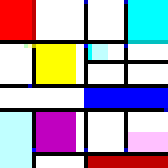

~

~ 0"!fnoCSJ olleH">:#,_@

~

~Arne Martin Aurlien
Boost Communications
@arnemart

----

~

# Implement a what now

~

--

An esoteric programming language

----

~

# What's that

~

--

A programming language designed to be impractical

----

~

--

* Brainfuck

```
++++++++[>++++[>++>+++>+++>+<<<<-]>+>+>->>+[<]<-]>>.>
---.+++++++..+++.>>.<-.<.+++.------.--------.>>+.>++.
```

--

* Malbolge

```
('&%:9]!~}|z2Vxwv-,POqponl$Hjig%eB@@>}=<M:9wv6WsU2T|nm-,jcL(I&%$#"
`CB]V?Tx<uVtT`Rpo3NlF.Jh++FdbCBA@?]!~|4XzyTT43Qsqq(Lnmkj"Fhg${z@>
```

--

* Piet



----

~

# wtf is a befunge

--

~

- Stack based
> No variables, all state is placed on an implicit stack
--
- Reflective
> Programs can read and write their own source code
--
- Multi-dimensional
> Programs consist of single-character commands on a grid, and an instruction pointer moving between these
--
- Described as “a cross between Forth and Lemmings”
> Which is fairly apt
--
- Super annoying
> As will become obvious in a moment
--
- Completely useless


----

# So let's see some code!
